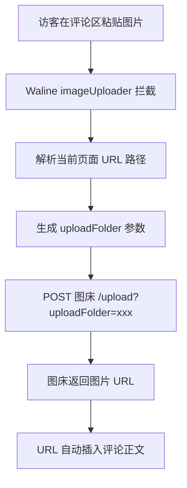

## 为什么要做这个

Waline 评论系统默认只支持填图片 URL，访客想发张图得自己找地方传完再贴链接——基本等于没人会发图。

但接上

[[博客相关/04-搭建个人图床]]

 里搭的 Cloudflare-ImgBed 之后，评论区直接支持**粘贴/选择图片自动上传**，体验完全不一样。更进一步，我还让它根据当前页面路径**自动归档到对应文件夹**，图床后台不会乱成一锅粥。

## 实现思路



核心就一件事：Waline 提供了 `imageUploader` 配置项，传一个函数进去，函数负责把图片文件传到图床、返回 URL，剩下的插入评论正文 Waline 自己搞定。

官方文档：[Waline 自定义图片上传](https://waline.js.org/cookbook/customize/upload-image.html)

## 准备工作

| 东西 | 说明 |
|------|------|
| 自建图床 | Cloudflare-ImgBed，[[博客相关/04-搭建个人图床\|第 4 期]]讲过怎么搭 |
| 图床 API Token | 图床管理面板 → Token 管理 → 创建，权限勾选 `upload` |
| Waline 已接入 | 评论系统跑起来了才有意义，迁移教程见 [[博客相关/Twikoo 评论完整迁移 Waline 教程/Twikoo 评论完整迁移 Waline 教程]] |

## 第一步：配置文件加入图床入口

在 `src/config/commentConfig.ts` 的 waline 配置里加两项：

```ts title="commentConfig.ts" {10-11}
waline: {
  serverURL: "",
  lang: "zh-CN",
  // ... 其他配置

  // ===== 评论图片上传（图床接入） =====
  // 图床上传地址（/upload 端点）
  imageUploadURL: "",
  // 图床 API Token —— 不要硬编码！走环境变量
  imageUploadToken: import.meta.env?.PUBLIC_IMG_UPLOAD_TOKEN || "",
},
```

> [!IMPORTANT] Token 安全
> Token 绝对不要直接写在代码里提交到仓库。通过环境变量注入：
> - **Vercel**：Settings → Environment Variables → 添加 `PUBLIC_IMG_UPLOAD_TOKEN`
> - **本地开发**：项目根目录 `.env` 文件添加 `PUBLIC_IMG_UPLOAD_TOKEN=imgbed_xxxxx`

两项都填了才启用上传，任一留空自动禁用——这个判断逻辑后面会写到。

## 第二步：补全类型声明

Astro + TypeScript 项目，新加的配置项和环境变量都要声明类型，不然编辑器会报错。

**配置类型**（`src/types/config.ts`）：

```ts title="types/config.ts"
waline?: {
  serverURL: string;
  lang?: string;
  login?: "enable" | "force" | "disable";
  visitorCount?: boolean;
  emoji?: string[];
  imageUploadURL?: string;   // ← 新增
  imageUploadToken?: string; // ← 新增
};
```

**环境变量类型**（`src/env.d.ts`）：

```ts title="env.d.ts"
interface ImportMetaEnv {
  readonly PUBLIC_IMG_UPLOAD_TOKEN: string; // ← 新增
}
```

## 第三步：实现 imageUploader

这是核心部分，在 `src/components/comment/Waline.astro` 里完成。

### 注入配置到客户端

Astro 组件的 frontmatter 是服务端代码，`imageUploader` 需要在浏览器里跑，所以用 `define:vars` 把配置注入到内联脚本：

```astro title="Waline.astro"
---
const imageUploadURL = commentConfig.waline?.imageUploadURL || "";
const imageUploadToken = commentConfig.waline?.imageUploadToken || "";
---
<script type="module" is:inline define:vars={{ config, imageUploadURL, imageUploadToken }}>
  import { init } from 'https://unpkg.com/@waline/client@v3/dist/waline.js';
  // ...
</script>
```

### 上传函数本体

```js title="imageUploader 核心逻辑"
if (imageUploadURL && imageUploadToken) {
  config.imageUploader = (file) => {
    var folder = getUploadFolder();
    var uploadURL = imageUploadURL + '?uploadFolder=' + encodeURIComponent(folder);

    var formData = new FormData();
    formData.append('file', file);
    return fetch(uploadURL, {
      method: 'POST',
      headers: {
        'Authorization': 'Bearer ' + imageUploadToken,
        'Accept': 'application/json',
      },
      body: formData,
    })
      .then((resp) => {
        if (!resp.ok) throw new Error('图片上传失败: ' + resp.status);
        return resp.json();
      })
      .then((data) => {
        // 解析响应，拿到图片 URL（下面细说）
        return url;
      });
  };
}
```

几个要点：

- **条件启用**：`imageUploadURL && imageUploadToken` 都成立才挂载 `imageUploader`，否则 Waline 走默认行为（不允许发图）
- **Bearer 认证**：cfbed 规范用 `Authorization: Bearer {token}` 请求头
- **FormData**：字段名必须是 `file`，这是 cfbed API 的约定

## 亮点：按页面路径自动归类

这是我觉得最实用的部分——不同页面的评论图片，自动传到图床的不同文件夹。

### 归类规则

```js title="getUploadFolder()"
function getUploadFolder() {
  var segments = window.location.pathname
    .split('/')
    .filter(function (s) { return s.length > 0; });
  if (segments.length === 0) return 'fqzlrcom/comments';
  var parts = segments.slice(0, 2);
  return 'fqzlrcom/' + parts.join('/');
}
```

规则很简单：

1. 前缀统一为 `fqzlrcom/`（域名标识，图床里一眼就知道是哪个站的图）
2. 取当前页面路径的**前 2 段**作为子文件夹
3. 超出的段直接截断，不无限建目录
4. 根路径 `/` 或解析失败时，回退到 `fqzlrcom/comments`

### 实际效果

| 评论所在页面 | 路径段 | 上传文件夹 |
|-------------|--------|-----------|
| `/friends/` | `friends` | `fqzlrcom/friends` |
| `/dynamic/` | `dynamic` | `fqzlrcom/dynamic` |
| `/posts/blog/check-flink/` | `posts` `blog` `check-flink` | `fqzlrcom/posts/blog`（截断第 3 段） |
| `/` | 无 | `fqzlrcom/comments`（回退） |

为什么最多取 2 段？文章路径 `/posts/博客相关/xxx/` 如果全取，文件夹会深到三四层，图床后台点进去找图很痛苦。2 段刚好能区分「哪个板块 + 哪个子分类」，够用了。

### 传给图床

cfbed API 通过 query 参数 `uploadFolder` 接收文件夹路径：

```text
POST ?uploadFolder=fqzlrcom%2Ffriends
```

记得 `encodeURIComponent`，路径里的 `/` 需要编码。

## 响应解析：兼容多种格式

cfbed 不同版本/配置的响应格式不完全一样，所以解析逻辑做了多路兼容：

```js title="响应解析"
var url = '';
if (Array.isArray(data) && data[0]) {
  // 格式一：[{ src, publicUrl }]
  url = data[0].publicUrl || data[0].src || '';
} else if (data?.data?.links?.url) {
  // 格式二：{ data: { links: { url } } }
  url = data.data.links.url;
} else if (data?.src) {
  // 格式三：{ src }
  url = data.src;
}
if (!url) throw new Error('图床响应格式异常');
```

还有一个容易踩的坑：**`publicUrl` 未配置时，`src` 是相对路径**（如 `/file/xxx.jpg`），直接插入评论会 404。需要拼接图床域名：

```js title="相对路径补全"
if (url.startsWith('/')) {
  url = new URL(imageUploadURL).origin + url;
}
```

`new URL(imageUploadURL).origin` 从上传地址里提取协议 + 域名（`https://tu.fqzlr.com`），不用额外硬编码域名配置。

## 完整文件改动清单

| 文件 | 改动 |
|------|------|
| `src/config/commentConfig.ts` | 新增 `imageUploadURL` / `imageUploadToken` 配置项 |
| `src/types/config.ts` | waline 类型补充两个可选字段 |
| `src/env.d.ts` | 声明 `PUBLIC_IMG_UPLOAD_TOKEN` 环境变量类型 |
| `src/components/comment/Waline.astro` | 实现 `getUploadFolder` + `imageUploader` |

四个文件，改动量不大，但评论区从此支持发图了。

## 常见问题

> [!WARNING] 图片上传失败怎么排查
> 1. 打开浏览器 DevTools → Network，看 `/upload` 请求的状态码
> 2. **401**：Token 错了或权限没勾 upload
> 3. **404**：`imageUploadURL` 地址写错了，确认是 `/upload` 端点
> 4. **响应格式异常**：图床版本不同响应结构可能不一样，对照上面的三路解析逻辑检查

> [!TIP] 本地测试
> `.env` 里配好 `PUBLIC_IMG_UPLOAD_TOKEN` 后跑 `pnpm dev`，在任意有评论区的页面粘贴图片即可测试。上传成功的话，图片 URL 会自动出现在评论输入框里。

## 最后

整个方案零额外成本：图床跑在 Cloudflare Workers 免费套餐上，Token 走环境变量不泄露，文件夹自动归类让图床后台始终清爽。

如果你也在用 Waline + Cloudflare-ImgBed，这套配置抄过去改改域名就能用。

---

> 图床搭建教程：[[博客相关/04-搭建个人图床]]
>
> Waline 官方图片上传文档：[waline.js.org/cookbook/customize/upload-image.html](https://waline.js.org/cookbook/customize/upload-image.html)
>
> cfbed API 规范：[cfbed.sanyue.de](https://cfbed.sanyue.de/api/upload.html)
>
> 有问题欢迎评论区交流～（对，就是本文接好的那个评论区）
